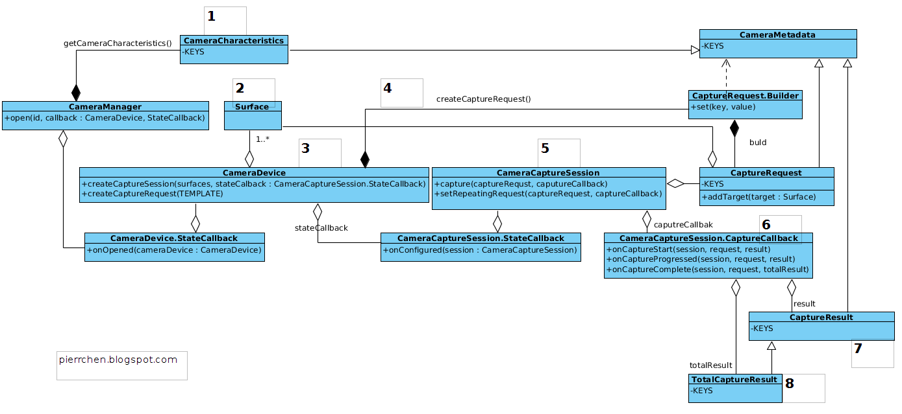

# AndroidCamera2API
AndroidCamera2API

Aandroid camera2 API introduced in level 21, our minimum android SDK for this project will be 21.

Android Camera2 Class Diagram

1. Start from CameraManager. We use it to iterate all the cameras that are available in the system, each with a designated cameraId. Using the cameraId, we can get the properties of the specified camera device. Those properties are represented by class CameraCharacteristics. Things like "is it front or back camera", "output resolutions supported" can be queried there.

2. Setup the output targets. The camera image data should always go to somewhere. Use SurfaceView or SurfaceTexture for preview, ImageReader for still picture or MediaRecoder for video recording. All those class have one common element hidden behind  - a Surface. What I means is, for all those classes mentioned, you always can create or get a surface, and, pass that surface to camera, as a capture request target. We'll come back the concept target in the followings steps talking about create a capture session with a list of targets and add a target to capture request.

3. Get a CameraDevice. You call CameraManager.open(cameraId) to get a CameraDevice. Since the call is asynchronized, you will get the CameraDevice in the onOpened() callback.

4. Create a CaptureRequest from the CameraDevice. A CaptureRequest is a immutable package of settings and outputs needed to capture a single image from the camera device. We usually don't create a CaptureRequest directly since that would be error prone and tedious, given the settings for a typical user case, say preview, is almost similar. Builder pattern is applied here. As shown in the class diagram above, a CaptureReques.Builder is created from CameraDevice with a predefined template (createCaptureRequest(CameraDevice.TEMPLATE_PREVIEW)). Then , we use the builder to set up the stuffs that varies. For example, usually you need to call addTarget(Surface) to set up the output targets for this specific CaptureRequest.

5. Create a CaptureRequestSession from the CameraDevice. Consider a CaptureRequestSession as a context in which CaptureRequest will be submitted. To initialize a CaptureRequestSession, you have to provided the initialized Surface as the target surfaces, which were discussed at step 2. Also note that the creation of CaptureRequestSession is also asynchronized. 

6. Submit a CaptureRequest to CaptureRequestSession. Now it is the time to issue the capture request. There are a couple of APIs to do that. Capture() is used to issue a one-time take picture command, while setRepeatingRequest() is used to issue a repeating request for the showing preview. Also, you may want to set various settings, such as the auto focus mode and white balance mode, before submitting the request to start the preview or take a picture.

7. Get the Capture Results. The capture result will get back to you asynchronously through CameraCaptureSession.CaptureCallback. It is the place you can play a sound when the capture starts, or finishes.  The results will approach you piece by piece in CaptureResult on onCaptureProcessed, or you can wait and get them all in TotalCaptureResult on onCaptureComplete.  That is the step 8 in the diagram. And, we're done.

Where are the camera picture data ? They are all good and they are handled by the output target as discussed in step 2. In all cases, the camera is the producer and the targets are the consumer. The camera keeps enqueuing the picture data and once the data is available the consumer will be notified to process them. TextureView will turn the picture data into textures and draw them in the area taken by the TexureView. MediaRecoder will pass the image to codec to compress and then write them out. For ImageReader, it is up to you how to process the data. 

Note: the explanation from l [here](https://pierrchen.blogspot.com/2015/01/android-camera2-api-explained.htmd).
